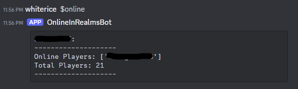

# Minecraft Realms Discord Bot

This is a Discord Bot that displays online users in your Minecraft Realm \



The bot displays total online users in its bio, which updates every 60s. \
The bot also lists online users and their usernames with the command
`$online` in a chat visible to the bot.

This bot works in tandem with [Minecraft Realms API Server](https://github.com/bhnord/discord-minecraft-bot)
running on the same machine

## Setup

### 1. Registering and Inviting Your Bot

Follow the directions [here](https://discordpy.readthedocs.io/en/stable/discord.html) and [create your own discord app](https://discord.com/developers/docs/quick-start/getting-started#step-1-creating-an-app)
Save the Discord Token generated by your app.

This app uses default bot permissions and does not require administrator.

Invite the bot to your server.

### 2. Setting up Your Realms API Server

Visit the other repository: [Minecraft Realms API Server](https://github.com/bhnord/discord-minecraft-bot)
and setup and the server via the instructions

### 3. Running a Virtual Environment

Run the following comamnds (Unix)

1. `python3 -m venv .venv` to create a virtual environment
2. `source ./.venv/bin/activate` to enter the virtual environment
3. `pip install -r requirements.txt` to install the necessary dependencies

### 4. Starting the Bot

1. Create a new file called `.env`
2. Input your Discord Token, and the default port for [Minecraft Realms API Server](https://github.com/bhnord/discord-minecraft-bot)
   in the file as shown below:

```text
DISCORD_TOKEN="your_discord_token_here"
API_LOCATION="http://127.0.0.1:5000"
```

Run `python3 bot.py` to start the bot
